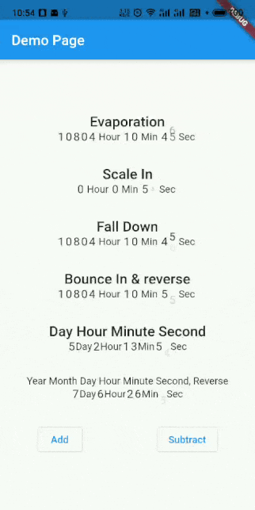

# Countdown text with animation.

### Preview:



### Feature:

- Auto calculate time pass.
- Build-in animations and custom animation builder.
- support reverse countDown.

### Basic Usage:

```dart
AnimateCountdownText(
               dateTime: DateTime(2020, 7, 16, 5, 13, 10),// Must provide
              format: (duration)=>DurationFormat(day:duration.inDays),
              characterTextStyle: TextStyle(fontSize: 16),
              animationType: AnimationType.bounceIn,
              reverse: true,
            )
```

### All parameters:

|Param|Desc|
|--|--|
|DateTime? dateTime|Compared DateTime, must provide.|
|FormatDuration format|Transform duration to human-readable format, (Duration)=>FormatDuration|
|AnimationType animationType|Build-in animation type, will ignore this if [animationBuilder] is provided|
|TextStyle characterTextStyle|Character TextStyle|
|TextStyle suffixTextStyle|Suffix TextStyle|
|Duration interval|Interval to refresh view, default to 1 second|
|bool reverse|Direction, default to false. Set it to true if you want to count reverse|
|Duration? expireDuration|The max duration that should mark countdown as done, If not null, [format] will return this as duration params when timeUp. Default to Duration.zero.|
|Duration? reverseExpireDuration|The max duration that should mark reverse countdown as done,<br/> If not null, [format] will return this as duration when timeUp. Default to null.|
|VoidCallback? onDone|Callback when timeUp. Only work when expireDuration is not null.|
|EdgeInsets characterPadding|Padding of characters, including character and suffix|
|AnimationBuilder? animationBuilder|Custom animation builder. |
